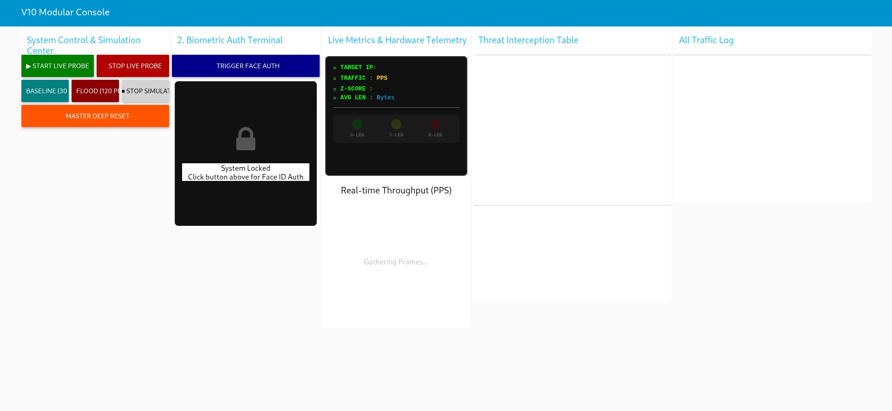
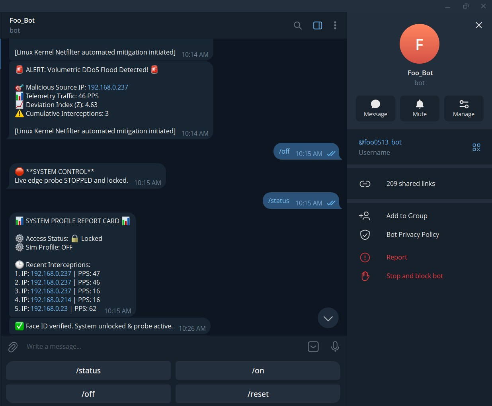
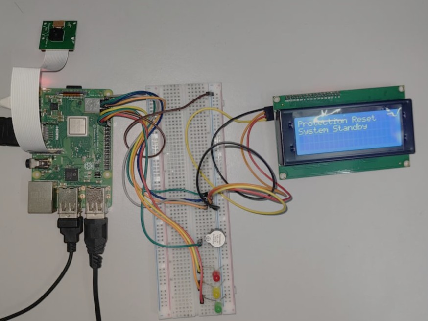
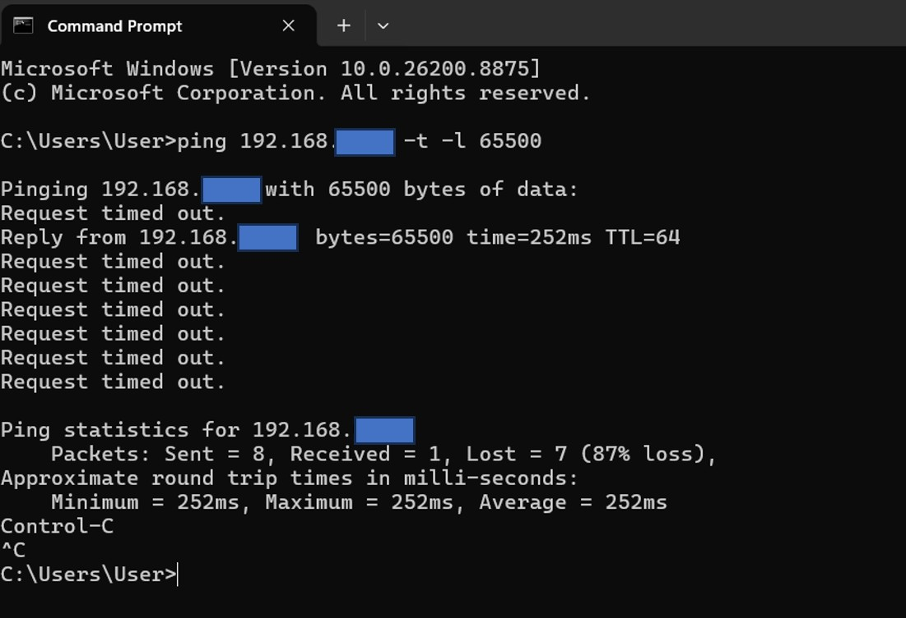
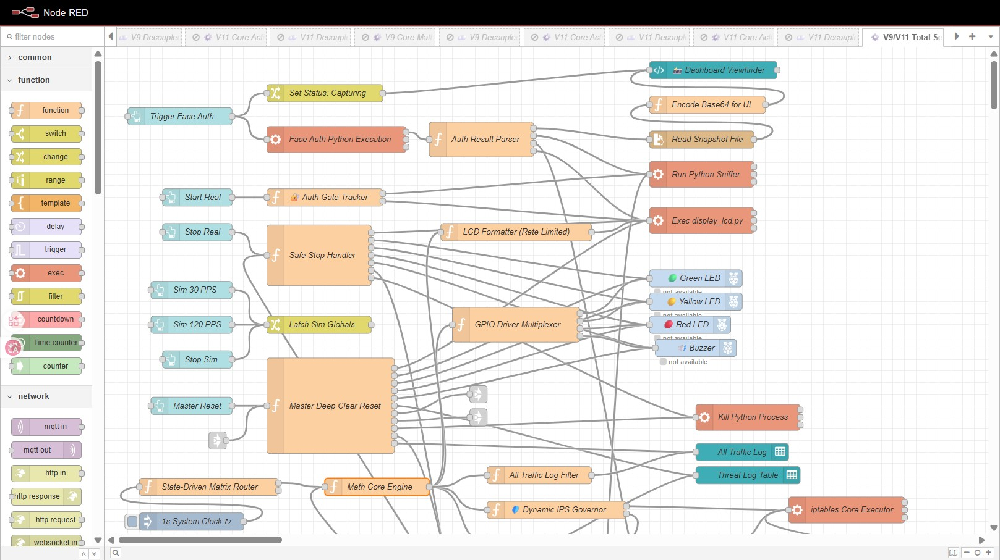
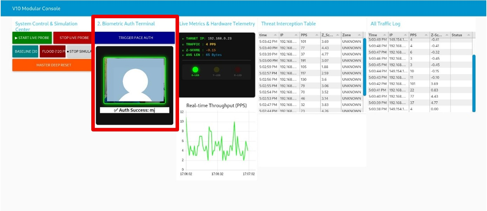

# 🛡️ Edge-Security-Sentinel

<p align="center">
  
  
  
  
</p>

<p align="center">
  <b>Bridging the Complexity-Visibility Gap in Edge Network Infrastructure.</b>
</p>

---

## ⚡ Overview
**Edge-Security-Sentinel** is a high-availability, AI-driven security framework designed for Raspberry Pi. It transforms edge hardware into a hardened network perimeter, capable of autonomous threat detection and intelligent mitigation.

## 🏗️ System Architecture
The system employs a dual-bus architecture, separating the core math engine from service modules to ensure operational stability:

*   **Core Math Engine**: Utilizes heuristic Z-Score and PPS (Packets Per Second) analysis to identify volumetric DDoS threats in real-time.
*   **Security Layer (IPS)**: An automated governor that interfaces with `iptables` to perform granular threat mitigation.
*   **Biometric Access Gateway**: Implements InsightFace-powered facial recognition, acting as a "Zero-Trust" physical key for system management.
*   **Modular Dashboard**: A centralized console for visualizing throughput, traffic logs, and firewall block lists.

## 📸 Operational Visuals

| **Modular Console Dashboard** | **Telegram Real-time Alerting** |
| :---: | :---: |
|  |  |
| *Traffic analysis & IPS status* | *Remote threat notifications & C2* |

---

## 🏗️ Core Modules

The system is built on a decoupled architecture for maximum stability:

### 1. Hardware Interface (`display_lcd.py`)

Provides physical status updates. It uses a **No-Clear-Write** methodology to update 20x4 LCD screens, preventing flickering and character garbage.
*   **Key Code**: `lcd.cursor_pos = (0, 0); lcd.write_string(lines[0][:20])`

### 2. Network Sniffer (`edge_probe_v2.py`)

A Scapy-based sentinel that monitors `wlan0`. It aggregates packets and computes telemetry data locally before pushing it to the Math Engine.
*   **Key Code**: `sniff(iface=TARGET_INTERFACE, prn=packet_callback, store=0)`

### 3. Math Core Engine (Node-RED)

The central intelligence. It calculates **Z-Score anomalies** to detect DDoS volumetric floods.

**Logic Definition**:
$$ Z = \frac{\text{currentPPS} - \mu}{\sigma} $$

### 4. Biometric Enrollment & Verification (`face_auth.py` & `local_face_api.py`)

The system enforces strict biometric access control to prevent unauthorized tampering, utilizing the **InsightFace (antelopev2)** model to perform 1:1 cosine similarity matching.
*   **Key Code**: `sim = np.dot(emb1, emb2) / (norm1 * norm2)`

**A. Enrollment (Registration)**
To register the administrator, capture a reference image and save it to the system. Ensure the image is well-lit and clearly shows your face as it will serve as the unique authentication template. 
```bash
sudo rpicam-still -t 3000 --width 640 --height 480 -o /home/mj/admin.jpg
