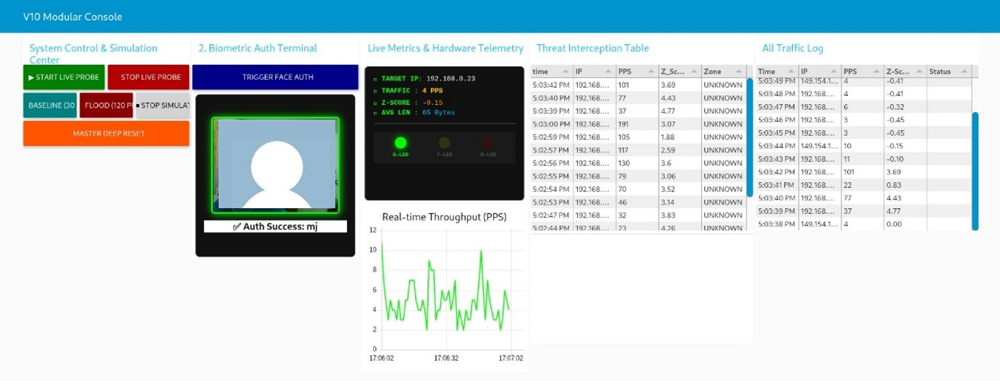
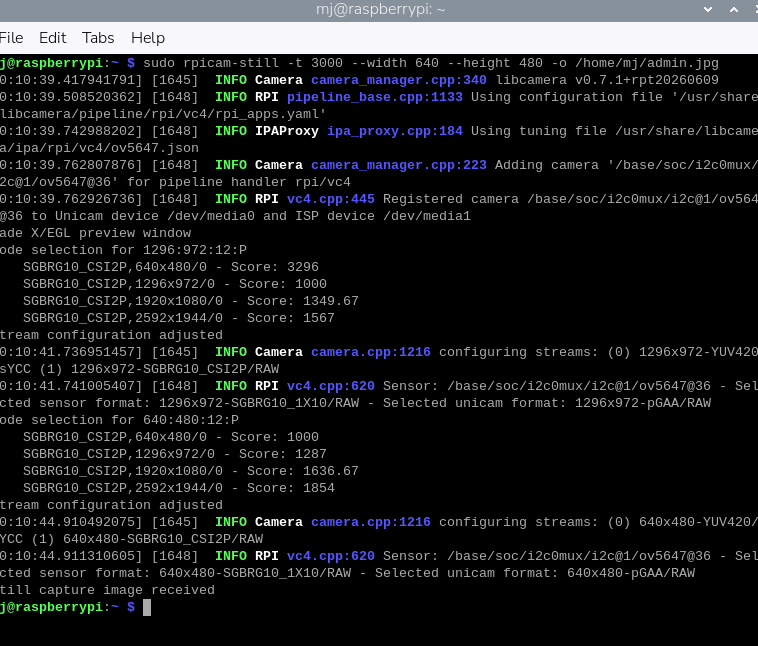

# 🛡️ Edge-Security-Sentinel

<p align="center">
  
  
</p>

<p align="center">
  <b>Bridging the Complexity-Visibility Gap in Edge Network Infrastructure.</b>
</p>

---

## ⚡ Overview
**Edge-Security-Sentinel** is a high-availability, AI-driven security framework designed for Raspberry Pi. It transforms edge hardware into a hardened network perimeter, capable of autonomous threat detection and intelligent mitigation.

## 🏗️ System Architecture
The system employs a dual-bus architecture, separating the core math engine from service modules to ensure operational stability:

*   **Core Math Engine**: Utilizes heuristic Z-Score and PPS (Packets Per Second) analysis to identify volumetric DDoS threats in real-time.
*   **Security Layer (IPS)**: An automated governor that interfaces with `iptables` to perform granular threat mitigation.
*   **Biometric Access Gateway**: Implements InsightFace-powered facial recognition, acting as a "Zero-Trust" physical key for system management.
*   **Modular Dashboard**: A centralized console for visualizing throughput, traffic logs, and firewall block lists.

## 📸 Operational Visuals
*(Upload your screenshots to `/docs` and update these paths)*

| **Modular Console Dashboard** | **Telegram Real-time Alerting** |
| :---: | :---: |
|  |  |
| *Traffic analysis & IPS status* | *Remote threat notifications & C2* |
|  |  |


## 🏗️ Core Architecture

The system is built on a decoupled architecture for maximum stability[cite: 6, 7]:

### 1. Hardware Interface (`display_lcd.py`)

Provides physical status updates. It uses a **No-Clear-Write** methodology to update 20x4 LCD screens, preventing flickering and character garbage[cite: 4].

* **Key Code**: `lcd.cursor_pos = (0, 0); lcd.write_string(lines[0][:20])`

### 2. Network Sniffer (`edge_probe_v2.py`)

A Scapy-based sentinel that monitors `wlan0`. It aggregates packets and computes telemetry data locally before pushing it to the Math Engine[cite: 5].

* **Key Code**: `sniff(iface=TARGET_INTERFACE, prn=packet_callback, store=0)`

### 3. Math Core Engine (Node-RED)

The central intelligence. It calculates **Z-Score anomalies** to detect DDoS volumetric floods.

* **Logic**: `zScore = (currentPPS - mean) / stdDev`[cite: 7].


### 4. Biometric Enrollment & Verification (`face_auth.py` & `local_face_api.py`)

The system enforces strict biometric access control to prevent unauthorized tampering.

Uses the **InsightFace (antelopev2)** model to perform 1:1 cosine similarity matching[cite: 1, 2].

* **Key Code**: `sim = np.dot(emb1, emb2) / (norm1 * norm2)`[cite: 2].

**A. Enrollment (Registration)**
To register the administrator, capture a reference image and save it to the system:
```bash
sudo rpicam-still -t 3000 --width 640 --height 480 -o /home/mj/admin.jpg
```

Ensure the image is well-lit and clearly shows your face as it will serve as the unique authentication template. 


**B. Verification (Access Check)**
The system utilizes face_auth.py to initiate secure access control. Upon execution, the system performs a live capture (/tmp/auth_frame.jpg) and compares the similarity score against your admin.jpg template.  Bashsudo python3 /home/mj/face_auth.py
AUTHORIZED:mj: Access granted; probe and control services are enabled.
DENIED:UNKNOWN_FACE_SCORE_xx: Verification rejected due to low confidence.
DENIED:NO_FACE_DETECTED: Capture failed to identify facial features.



🛠️ Deployment ProtocolStart AI Backend: Ensure the recognition API is running as a background service[cite: 1]:
```Bash
sudo python3 /home/mj/face_auth.py
```

### 🛠️ Modules & Features


### Telegram Integration (`node-red-contrib-telegrambot`)

Allows remote administration. It broadcasts DDoS alerts and accepts control commands like `/on`, `/off`, `/reset`, and `/status` via an interactive inline keyboard[cite: 7].

### Dashboard & Metrics (`node-red-dashboard`)

Provides a real-time digital twin of the network, synchronized across `Threat Logs`, `All Traffic Logs`, and `Active Firewall Blocks` tables, ensuring full network visibility[cite: 7].

### IPS & Dynamic Governor

Automatically injects `iptables` rules when a threat reaches a critical state. It features a heuristic hit-map system to distinguish between transient warnings and persistent attacks[cite: 7].


## 🔧 Deployment

1. **Requirements**: Raspberry Pi, Node-RED, InsightFace dependencies[cite: 2, 7].
2. **Setup**:
```bash
# Enable background AI service
nohup python3 /home/mj/local_face_api.py > api.log 2>&1 &

```


3. **Flows**: Import the provided `flows.json` and configure your `chatId` in the Telegram function nodes[cite: 7].


## 🎓 Academic Context

This project originates from research into **Network Tool Analysis** and the **Complexity-Visibility Gap**, aiming to provide affordable, high-end security tools for constrained edge devices[cite: 3].
